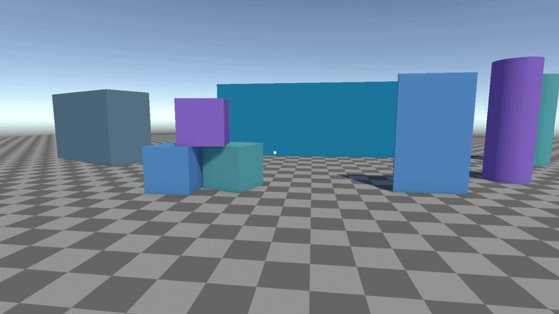
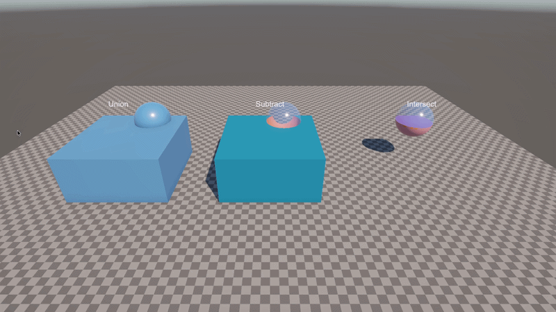
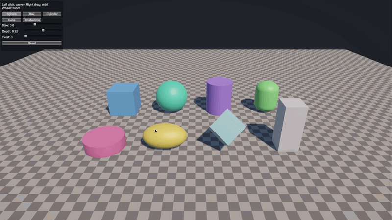

# ManifoldCSG for Unity

Boolean mesh operations (subtract, union, intersect) for Unity at runtime. Objects can be changed
repeatedly, e.g. by a weapon that cuts a hole with every hit. The geometry is computed by
[Manifold](https://github.com/elalish/manifold), included as a native plugin.

<p align="center">
  
</p>
<p align="center">
  
  
</p>

## Requirements

- Unity 6 (tested with 6000.5). The demos use URP and the Input System package.
- macOS (arm64 and x86_64) and Windows x64, Editor and Standalone. No Linux, mobile or WebGL library.
- Meshes must be closed (every edge shared by exactly two triangles) and have Read/Write enabled.
  Unity's Cube, Sphere, Cylinder and Capsule meshes work, the Plane does not.

## Usage

1. Add a `CsgBody` component to the object you want to change.
2. Create a tool: *Create > ManifoldCSG > CSG Shape*.
3. Apply the tool from a script:

```csharp
using ManifoldCSG;
using UnityEngine;

public class SimpleGun : MonoBehaviour
{
    public CsgShape bullet;
    public float size = 0.3f;

    public void Fire(Ray ray)
    {
        RaycastHit hit;
        if (!Physics.Raycast(ray, out hit)) return;
        CsgBody body = hit.collider.GetComponent<CsgBody>();
        if (body == null) return;

        // CSG Shape primitives are unit size, +Y points out of the surface
        Quaternion rotation = Quaternion.FromToRotation(Vector3.up, hit.normal);
        Matrix4x4 toolToWorld = Matrix4x4.TRS(hit.point, rotation, Vector3.one * size);
        body.Subtract(bullet, toolToWorld);
    }
}
```

## CsgBody

Component for objects that are changed repeatedly. The mesh is imported on the first operation; until
then the object is left as it is.

| Setting | Description |
|---|---|
| Interior Material | Material of faces cut into the body. Empty: same as the outside. |
| Normals | Recalculate from the geometry, or keep the mesh's imported normals. |
| Sharp Angle | Recalculate only: edges sharper than this angle stay hard. |
| Colliders | Auto, Exact, Convex or Keep, see [Colliders](#colliders). |
| Scale Mass With Volume | Scales the Rigidbody's mass with the remaining volume. |
| When Empty | Destroy, deactivate or keep the object when nothing is left. |

| Member | Description |
|---|---|
| `Subtract`, `Union`, `Intersect` | Take a `CsgShape` and a matrix, a `Mesh` and a matrix, or a `MeshFilter` (uses its transform). Return `false` on failure; the body is then unchanged. |
| `Apply(operation, ...)` | Same as above with a `CsgOperation` value. |
| `LastError` | Reason for the last failure. |
| `ResetShape()` | Restores the original mesh, materials, colliders and mass. |
| `InteriorMaterial` | Can be changed at runtime. |
| `Operations`, `IsEmpty`, `Volume`, `TriangleCount` | Current state. |
| `Changed` | Event after every change. |

## CSG Shape

Asset that defines a tool. It can be used by any number of bodies.

- Primitive: sphere, box, cylinder or cone, unit size (fits a 1 × 1 × 1 box), +Y points out of the surface.
  Segments sets the circle resolution.
- Mesh: any closed mesh, at its own size, pivot as origin.
- Material: optional, see [Materials](#materials).
- `PreviewMesh`: a Unity mesh of the shape, e.g. for a preview.

Each cut adds about half of the tool's triangles to the body. Use low resolutions for repeated cuts
(8 to 16 segments for bullet holes).

## Materials

- Faces keep the material of the mesh or submesh they came from.
- Faces created by Subtract and Intersect get the body's Interior Material.
- Faces created by Union get the body's first material.
- If a CSG Shape has a Material, its faces always get that material.

Cut faces have no UVs. Use untextured interior materials.

## Colliders

| Mode | Behavior |
|---|---|
| Auto | Exact; Convex with a non-kinematic Rigidbody; nothing if the object has no collider. |
| Exact | Non-convex MeshCollider of the current shape. Raycasts and physics see the holes. |
| Convex | Convex MeshCollider of the current shape. Works with dynamic Rigidbodies; holes are filled. |
| Keep | Colliders are not changed. |

With Exact and Convex, the first operation reuses an existing MeshCollider or adds one, and disables the
other non-trigger colliders. `ResetShape` restores them.

## One-shot operations

`Csg` combines two meshes once, without a component. The result is a new mesh in the local space of the
first object. Both meshes are imported on every call.

```csharp
Mesh result = Csg.Subtract(workpiece, cutter);       // MeshFilters; also Union, Intersect
if (result != null) workpiece.sharedMesh = result;

Mesh split = Csg.Subtract(workpiece, cutter, true);  // cut faces in an extra submesh

string message;
if (!Csg.Check(mesh, out message)) Debug.Log(message);
```

## Low-level API

`Manifold` wraps a native Manifold object, `ManifoldUnity` converts between `Manifold` and
`UnityEngine.Mesh`. Each `Manifold` holds native memory and must be disposed.

```csharp
using (Manifold work = ManifoldUnity.FromUnityMesh(meshFilter.sharedMesh))
using (Manifold raw = Manifold.Sphere(0.4, 32))
using (Manifold sphere = raw.CalculateNormals(50))
using (Manifold hole = ManifoldUnity.Transform(sphere, Matrix4x4.Translate(new Vector3(0.5f, 0, 0))))
using (Manifold result = work.Boolean(hole, CsgOperation.Subtract))
{
    meshFilter.mesh = ManifoldUnity.ToUnityMesh(result.GetMeshData(null, 0));
}
```

Further operations: `Hull`, `Split`, `Decompose`, `Batch`, `TrimByPlane`, `Volume`, `GetBounds`.
`Manifold` does not use the Unity API and can run on other threads. `CsgBody`, `Csg` and the mesh
conversions must run on the main thread.

## Performance

Cost grows with the triangle count of the body. 8 m wall, 12-segment sphere, Apple Silicon:

| Hits | 1-10 | 50 | 100 | 150 |
|---|---|---|---|---|
| Triangles | < 1k | ~5k | ~10k | ~15k |
| Exact collider | 0.5 ms | 3 ms | 6 ms | 9 ms |
| Keep collider | 0.3 ms | 2 ms | 4 ms | 5 ms |

Profiler markers: `CsgBody.Apply`, `CsgBody.UpdateMesh`, `CsgBody.UpdateCollider`.

## Limitations

- Cut faces have no UVs and no tangents.
- A tool face that lies exactly in the body's surface leaves a thin skin instead of an opening.
- Errors inside the native library crash the Editor. Inputs are validated before they are passed on.

## Samples

In `Demo/`:

- `CsgDemo`: Union, Subtract and Intersect, each applied every frame with a moving sphere.
- `CsgCarving`: click to cut a tool shape out of an object. Right mouse button orbits, wheel zooms.

The shooter GIF is from a separate project and not included.

## Folder structure

| Folder | Contents |
|---|---|
| `Runtime/` | Scripts (assembly `ManifoldCSG`) |
| `Editor/` | Inspectors for CsgBody and CSG Shape |
| `Plugins/` | Native libraries (Manifold v3.5.3 with its C API) and third-party licenses |
| `Demo/` | Sample scenes, scripts, materials, shapes |
| `Tests/` | EditMode tests |
| `Documentation~/` | Images for this README (not imported by Unity) |

## License

ManifoldCSG is released under the MIT License, see [LICENSE](LICENSE).

It uses [Manifold](https://github.com/elalish/manifold) (Apache License 2.0) and
[Clipper2](https://github.com/AngusJohnson/Clipper2) (Boost Software License 1.0). The license texts are in
`Plugins/THIRD_PARTY_LICENSES.txt` and must be included in builds.
